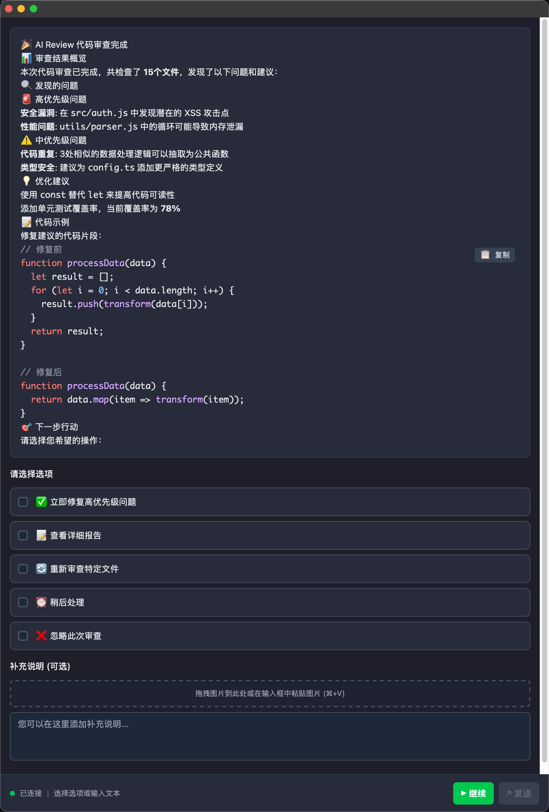

# 寸止 (Cun Zhi)

English | [简体中文](./README.md)

寸止 (Cun Zhi) is an intelligent code review tool based on MCP (Model Context Protocol), providing popup interaction and memory management features.

## ✨ Features

- 🎯 **MCP Standard Compliant**: Fully compliant with MCP 2024-11-05 protocol specification
- 🎨 **Beautiful Popup Interface**: Modern UI built with Vue 3 + Tailwind CSS
- 🔒 **Safe Markdown Rendering**: Supports code highlighting and secure content rendering
- 🖥️ **Native App Experience**: Cross-platform desktop app based on Tauri
- ⚡ **Efficient Communication**: Uses inter-process communication for fast response
- 🛠️ **Flexible Interaction**: Supports predefined options, multi-selection, and free text input
- 🧠 **Global Memory Management**: Intelligently stores and manages development standards, user preferences, and best practices
- 📷 **Image Support**: Supports image upload and Base64 processing

## 📸 Feature Demo

### Smart Popup Interface



*寸止's modern popup interface with Markdown rendering, code highlighting, predefined options, and free text input*

## 🚀 Quick Start

### macOS Installation

```bash
# 1. Install frontend dependencies
pnpm install

# 2. Build project
cargo build --release

# 3. Global installation (recommended, requires admin privileges)
./install.sh

# 4. Verify installation
which ai-review-mcp
```

### Windows Installation (Untested)

```powershell
# 1. Install frontend dependencies
pnpm install

# 2. Build project
cargo build --release

# 3. Manually copy executable to system PATH
# Copy target\release\ai-review-mcp.exe to C:\Windows\System32\ or other PATH directory

# 4. Verify installation
where ai-review-mcp
```

### Local Development

```bash
# 1. Install dependencies
pnpm install

# 2. Run frontend in development mode
pnpm dev

# 3. Build and run MCP server
cargo build --release
./target/release/ai-review-mcp  # macOS/Linux
# or
.\target\release\ai-review-mcp.exe  # Windows
```

## 📋 Workflow

### System Architecture

```
AI IDE/Claude Desktop
        ↓ (MCP call)
AI Review MCP Server
        ↓ (Launch popup)
Tauri App (Vue + Tailwind CSS)
        ↓ (User interaction)
Response returned to MCP Server
```

### Communication Methods

- **MCP Protocol**: JSON-RPC 2.0 over stdio
- **Popup Launch**: Direct call to Tauri application
- **User Interface**: Native Tauri app (Vue + Tailwind CSS)
- **Response Delivery**: Inter-process communication, real-time response

## 🛠️ MCP Tools

### 1. ai_review_chat - Smart Interaction Tool

Popup interaction tool supporting multiple input methods and Markdown rendering.

**Main Parameters**:
- `message` (required): Message content to display to user
- `predefined_options` (optional): List of predefined options, supports multi-selection
- `is_markdown` (optional): Whether to enable Markdown format rendering

**Features**:
- ✅ Predefined option multi-selection + free text input
- ✅ Image upload and Base64 processing
- ✅ Markdown rendering and code highlighting
- ✅ Modern dark theme UI

### 2. memory_manager - Global Memory Management Tool

Intelligent memory management system that stores development standards and preference settings by project.

**Main Parameters**:
- `action` (required): Operation type - `add` or `get_project_info`
- `project_path` (required): Project path (git root directory)
- `content` (required for add): Memory content
- `category` (optional): Category - `rule`/`preference`/`pattern`/`context`

**Features**:
- ✅ Project-isolated memory storage
- ✅ Intelligent categorized management (rules/preferences/patterns/context)
- ✅ Automatically recognizes "Please remember:" and adds memory

## 🔧 Configuration

### Claude Desktop Configuration

#### After Global Installation (Recommended)

Add to `~/.config/claude-desktop/claude_desktop_config.json`:

```json
{
  "mcpServers": {
    "ai-review": {
      "command": "ai-review-mcp",
      "args": []
    }
  }
}
```

#### Local Run

```json
{
  "mcpServers": {
    "ai-review": {
      "command": "/path/to/ai-review/target/release/ai-review-mcp",
      "args": []
    }
  }
}
```

### Cursor Configuration

Add to Cursor's MCP settings:

```json
{
  "name": "ai-review",
  "command": "ai-review-mcp"  // macOS/Linux
  // Windows: "command": "ai-review-mcp.exe"
}
```

### Windows Configuration Notes (Untested)

Windows users need to:
1. Ensure `ai-review-mcp.exe` is in system PATH
2. Use `.exe` extension in configuration files
3. May need to use full path: `"C:\\path\\to\\ai-review-mcp.exe"`

## 📁 Project Structure

```
ai-review/
├── src/
│   ├── main.rs              # Tauri main application
│   ├── mcp_server.rs        # MCP server implementation
│   ├── memory.rs            # Memory management module
│   ├── components/
│   │   └── McpPopup.vue     # MCP popup component
│   ├── utils/
│   │   └── message.js       # Message processing utilities
│   ├── App.vue              # Main app component
│   ├── main.js              # Frontend entry
│   └── style.css            # Style file
├── scripts/
│   └── postinstall.sh       # Post-installation script
├── icons/
│   └── icon.png             # App icon
├── install.sh               # Global installation script
├── Cargo.toml               # Rust dependencies
├── package.json             # Frontend dependencies
├── tauri.conf.json          # Tauri configuration
└── README.md                # Project documentation
```

## 🧪 Testing

### Function Testing

```bash
# Start MCP server for testing
./target/release/ai-review-mcp

# Test MCP communication in another terminal
echo '{"jsonrpc": "2.0", "id": 1, "method": "tools/list"}' | ./target/release/ai-review-mcp
```

### Popup Testing

Test by calling the `ai_review_chat` tool through Claude Desktop or other MCP clients.

## 🔍 Troubleshooting

### Common Issues

1. **Popup Won't Start**
   - Check if app is correctly installed to `/Applications/AI Review.app`
   - Verify command line tool links: `which ai-review-mcp`
   - Re-run installation script: `./install.sh`

2. **MCP Server Not Responding**
   - Check if executable exists: `./target/release/ai-review-mcp`
   - Run `cargo build --release` to rebuild
   - Check error logs: `RUST_LOG=debug ai-review-mcp`

3. **Memory Management Issues**
   - Ensure using in git repository root directory
   - Check `~/.ai-review/` directory permissions

### Debug Mode

```bash
# Enable verbose logging
RUST_LOG=debug ai-review-mcp

# View memory files
ls -la ~/.ai-review/
```

## 🛠️ Development

### Adding New Features

1. **Modify MCP Server**: Edit `src/mcp_server.rs`
2. **Update Popup Interface**: Edit `src/components/McpPopup.vue`
3. **Test Changes**: Run `cargo build --release` to recompile

### Build Release Version

```bash
# Build optimized version
cargo build --release

# Build complete app package
./install.sh --build-only
```

## 🤖 AI Generated Notice

**Important Notice**: All code in this project is generated by AI, not manually written by humans. This includes but is not limited to:
- Rust backend code (MCP server, memory management)
- Vue frontend code (popup interface, components)
- Configuration files (Tauri, Vite, ESLint, etc.)
- Documentation content (README, comments)

This is a project showcasing AI code generation capabilities, with code quality and best practices autonomously completed by AI.

## 📄 License

MIT License

## 🤝 Contributing

Issues and Pull Requests are welcome!

## 📞 Support

For questions, please create a GitHub Issue or contact the maintainer.
